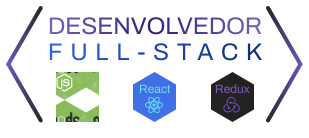

<h1 align="center">
	
</h1>

 

# Bem vindo!
 
## Eu sou Bruno Amaral Futema!
 
- Sou desenvolvedor a mais de 2 anos.
- Atuo como desenvolvedor full-stack.
- Aplicações Web Responsivas.
- Apaixonado pela tecnologia.
- Foco intenso em 3 pilares: Web, Mobile & Arquitetura de Software

## Tecnologias!

<!--
-->

<!--
### Hi there 👋

**BrunoFutema/BrunoFutema** is a ✨ _special_ ✨ repository because its `README.md` (this file) appears on your GitHub profile.

Here are some ideas to get you started:

- 🔭 I’m currently working on ...
- 🌱 I’m currently learning ...
- 👯 I’m looking to collaborate on ...
- 🤔 I’m looking for help with ...
- 💬 Ask me about ...
- 📫 How to reach me: ...
- 😄 Pronouns: ...
- ⚡ Fun fact: ...
-->
